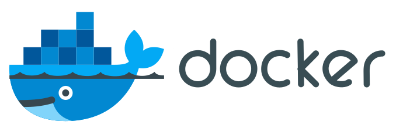
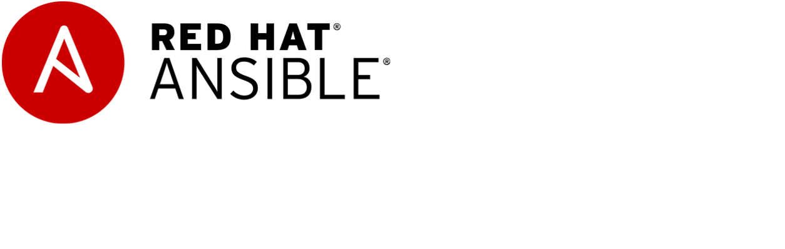

<h1 align="center">Namaste 🙏 I'm Dipaditya Das.</h1>

<h3 align="center"><samp>I am an Indian Engineer and Developer.</samp></h3>

&nbsp;
&nbsp;
&nbsp;
&nbsp;
&nbsp;
&nbsp;

- 🔭 I’m currently working on **JARVIS Assistant**
- 🌱 I’m currently learning **Flutter, Ansible(RH294) and Advanced Python**
- 👯 I’m looking to collaborate on **Multi-Cloud Infrasturcture**
- 👨‍💻 All of my projects are available at [https://github.com/DipadityaDas](https://github.com/DipadityaDas)
- 📝 I regulary write articles on [https://medium.com/@dipadityadas](https://medium.com/@dipadityadas)
- 💬 Ask me about **Python, Java, RHEL8, Flutter, Hybrid-Multi-Cloud**
- 📫 How to reach me **DipadityaDas@gmail.com**
- ⚡ Fun fact **I ❤ Kolkata Biriyani**

<!-- ### Blogs posts -->
<!-- BLOG-POST-LIST:START -->
<!-- BLOG-POST-LIST:END -->

### ⚡ Languages and Tools ⚡

&nbsp;
&nbsp;
&nbsp;
&nbsp;
&nbsp;
&nbsp;
&nbsp;
&nbsp;
&nbsp;
&nbsp;
&nbsp;
&nbsp;
&nbsp;
&nbsp;
&nbsp;
&nbsp;
&nbsp;
&nbsp;
&nbsp;
&nbsp;
&nbsp;
&nbsp;
&nbsp;
&nbsp;
&nbsp;
&nbsp;
&nbsp;
&nbsp;
&nbsp;
&nbsp;
&nbsp;
&nbsp;
&nbsp;
&nbsp;
&nbsp;
&nbsp;
&nbsp;
&nbsp;
&nbsp;
&nbsp;
&nbsp;
&nbsp;
&nbsp;
&nbsp;
&nbsp;
&nbsp;

  
🚀 GitHub Stats

  

	  
  

